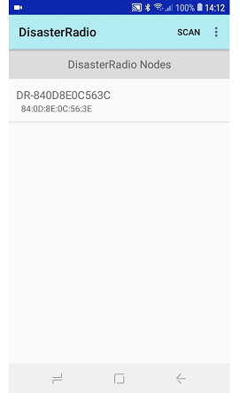
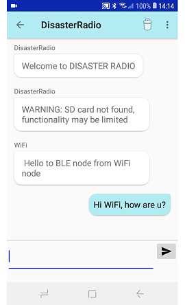
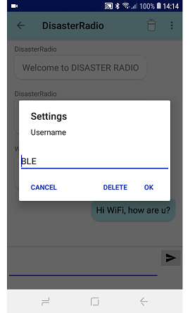

# Chat application for DisasterRadio

_**[disaster.radio](https://disaster.radio)**_    
**a resilient communications network.**    

This app connects over BLE to a nearby LoRa node that runs the [DisasterRadio firmware](https://github.com/sudomesh/disaster-radio).    
_disaster.radio is a collaborative project between Sudo Mesh and Secure Scuttlebutt, with additional support from the Internet Society and Institute For the Future_    
Except where otherwise noted, this app is licensed under a GNU General Public License v3 license.

## Using the app
To be able to use the Android app to connect to a DisasterRadio LoRa node, the node must run the [DisasterRadio firmware](https://github.com/sudomesh/disaster-radio). Please check the Github repo how to create and flash a DisasterRadio version that supports BLE.    

I created a [fork of the original code](https://github.com/beegee-tokyo/disaster-radio) that supports BLE and runs on the [Sparkfun ESP32 LoRa board](https://www.sparkfun.com/products/15006) and on the [Adafruit ESP32 Huzzah board](https://www.adafruit.com/product/3405) connected to a [Circuitrocks Alora RFM1262 LoRa board](https://circuit.rocks/product:2685). 

## Using the maps
The maps view is based on [OpenStreetMap osmdroid API](https://github.com/osmdroid/osmdroid). By default the app will load the required maps online based on usage. To use an offline map, you have to create a map that is compatible with OSM. You can use e.g. [Mobile Atlas Creator (MOBAC)](https://mobac.sourceforge.io/) and create a map covering the region you need. At the moment only one map is supported. Read the [osmdroid Wiki](https://github.com/osmdroid/osmdroid/wiki/Offline-Map-Tiles) which map formats are supported, how to create a map and where to store it on your phone. The Wiki says to put the maps into **`/sdcard/osmdroid/`**. If you have a phone without SD card just put it into **`/osmdroid`** into the phone folder you see when opening the phone on your PC.
On my Samsung Galaxy J2 Core the Windows path looks like    
**`Computer\SM-J260Y\Phone\osmdroid`**.    
On my Huawei M5 tablet the path looks like    
**`Computer\ThisIsMine\Internal storage\osmdroid`**.    
A sample map for Philippines, Metro Manila, Sucat road can be found in the maps folder.
As DisasterRadio is designed to communicate in cases where none of the usual communication means are available, it is recommended that you create a map of your region in advance and save it on your phone.

## Credits
The sources are based on Kai Morich [SimpleBluetoothLeTerminal](https://github.com/kai-morich/SimpleBluetoothLeTerminal)    
Thank you Kai for making his very well working code public domain.    
_**REMARK**_: Kai published his code under MIT license. 

The design of the chat box is taken from the Android Chat Tutorial of [scaledrone](https://www.scaledrone.com/blog/android-chat-tutorial/)    
Thank you scaledrone for writing this nice tutorial

The maps view is based on [OpenStreetMap osmdroid API](https://github.com/osmdroid/osmdroid).
-**REMARK**_ osmdroid is published under Apache License 2.0

## Build the app
The source code is using AndroidX framework. Minimum SDK version is 19 (KitKat), so it will not work on older phones. But that should not be a problem, as BLE is only supported on newer phones.    
The code was made using Android Studio Version 3.5.3

## License
To match with the licenses used in the disaster.radio project, this source code is licensed under the GNU GENERAL PUBLIC LICENSE Version 3

## Images
| Scan screen | Scan screen menu |    
| :----: | :----: | 
|  |  |    
| **About** | **Chat room** |    
|  |  |    
| **Chat room menu** | **Setup username** |    
|  |  |    
 
